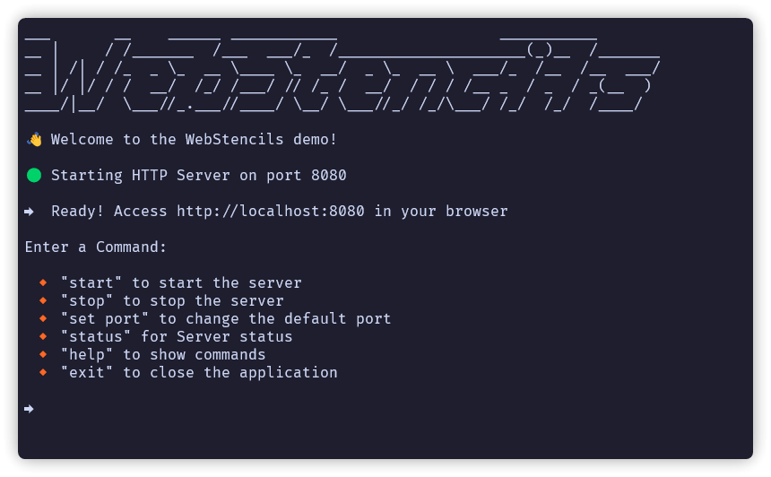

# WebStencils C++ Builder Demo Project

## 🌟 Overview
This project demonstrates the usage of WebStencils using WebBroker in a C++ Builder environment. It includes part of the documentation built into the generated website, as well as a couple of demos, mirroring the functionality of the Delphi version.

## 🚦 Getting Started
The project is designed to be run on Windows using C++ Builder.

Simply open the project in the C++ Builder IDE, build it, and run it. The default behavior attempts to locate the HTML templates and database relative to the executable's path. For a production environment, you would typically adjust these paths.

## 📚 Examples
### Docs
Most of the menus explain the general use of WebStencils as well as some suggested ideas for templating patterns.

### Big Table
This demo loads 1000 customers loaded in a FireDAC query. Customers data is stored in a `sqlite` database located in `resources/data`.

### Pagination
Same `customers` table, but this time using server-side pagination.

### To-Do app - HTMX Integration
The project includes an example of using HTMX with WebStencils for dynamic content updates. See the `tasks.html` template and related C++ code (`ControllerTasks.h`/`.cpp`, `ModelTasks.h`/`.cpp`) for implementation details.

## 📁 Project Structure
The project consists of the following main components:
1. C++ source files (`.cpp` and `.h`)
2. Delphi Form files (`.dfm`)
3. HTML templates (`.html`)
4. Static assets (CSS, JavaScript, images)

### 🔑 Key C++ Files
- `WebStencilsDemo.cbproj`: The main C++ Builder project file.
- `MainWebModule.h`/`.cpp`: Handles web requests and sets up the WebStencils engine.
- `ModelTasks.h`/`.cpp` and `ControllerTasks.h`/`.cpp`: Implement the Tasks demo functionality (Tasks are stored in memory using a singleton).
- `ControllerCustomers.h`/`.cpp`: Contains the controller used for `Big Table` and `Pagination` demos.
- `ModelPaginationParams.h`/`.cpp` defines a reusable pagination system for WebStencils.
- `Helpers` namespace (in `ClassHelpers.h`): Includes multiple class helpers to simplify functionality like routing in a WebModule or pagination on a FDQuery.
- `CodeExamplesU.h`/`.cpp`: Contains code examples used in the demo pages.

### 📄 HTML Templates
- Located in the shared `resources/html` directory.
- `layouts/mainLayout.html`: The main layout template.
- Various content pages (e.g., `home.html`, `basics.html`, `keywords.html`).
- Partial templates that can be reused in the `partials/` directory.
- `partials/tasks`: Templates specific to the HTMX Tasks demo.
- `partials/customers`: Templates for the `Big Table` and `Pagination` demos.

> **IMPORTANT**
> The `codeBlock` template has a `copy` button. Due to browser security limitations, this only works if the URL is `localhost` or if it's being run under https. If the demo is accessed through the network, the button may not be functional.

## 💻 Web Tech Used
- Bootstrap 5.3
- Bootstrap icons
- HTMX 2.0.2
- Minor custom CSS and JS

All the external dependencies are loaded directly from CDNs. The custom CSS and JS can be found in the shared `resources/static` folder.

## ✨ Environment Variables
- The `MainWebModule` demonstrates handling custom variables accessible in templates via `@env.VARIABLE_NAME` (e.g., `@env.APP_NAME`, `@env.APP_EDITION`).
- It also shows handling system variables like `@system.year`.
- The `DEBUG_MODE` variable is automatically set based on the build configuration (`#ifdef _DEBUG`). 