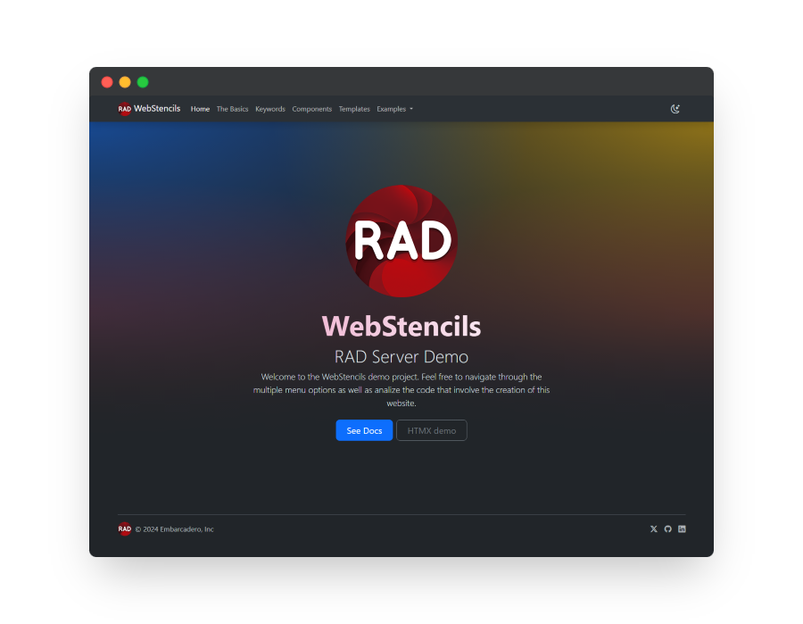

# WebStencils Demo - RAD Server Project

## 🌟 Overview 
This project demonstrates the usage of WebStencils with RAD Server. It includes part of the documentation built into the generated website, as well as a couple of demos. 

## 🚦 Getting Started
Given the nature of RAD Server, paths must be absolute, which means that the database as well as the templates and extra resources must be correctly mapped. To edit this, simply edit the constant `LProjectPath`  defined on the `DataModuleCreate` event to the absolute path where this project file is located.  

**IMPORTANT**: The codeBlock snippet has a `copy` button. Due to browser security limitations, this only works if the URL is "localhost" or if it's being run under https. If the demo is accessed through the network, the button is not functional. 
> _This project has been tested on Windows._

## 📚 Examples 
### Docs 
Most of the menus explain the general use of WebStencils as well as some suggested ideas for templating patterns. 

### Customers
This demo loads 1000 customers pre-loaded in an InterBase database. The customers are stored in a table in the database file in `resources/data/tasks.ib`.

### To-Do app - HTMX Integration
The project includes an example of using HTMX with WebStencils for dynamic content updates. See the `tasks.html` template and related Delphi code for implementation details.

## 📁 Project Structure 
The project consists of the following main files:
1. Delphi units (`.pas`)
2. InterBase database (`.ib`)
3. HTML templates (`.html`)
4. Static assets (CSS, JavaScript, images)

### 🔑 Key Delphi Units
- `WebStencilsRADServerDemo.dpr`: The main project file
- `WebResource.pas`: RAD Server resource that handles web requests, creates the required endpoints and maps all the required files
- `Tasks.Model.pas` and `Tasks.Controller.pas`: Implement the Tasks demo functionality
- `CodeExamplesU.pas`: Contains code examples used in the demo pages

### 📄 HTML Templates
- `layouts/mainLayout.html`: The main layout template
- Various content pages (e.g., `home.html`, `basics.html`, `keywords.html`)
- Partial templates in the `partials/` directory

## 💻 Web Tech Used
- Bootstrap 5.3
- Bootstrap icons
- HTMX 2.0.2 (with JSON-enc extension)
- Minor custom CSS and JS 

All the external dependencies are loaded directly from CDNs. The custom CSS and JS can be found in the `static` folder. 
